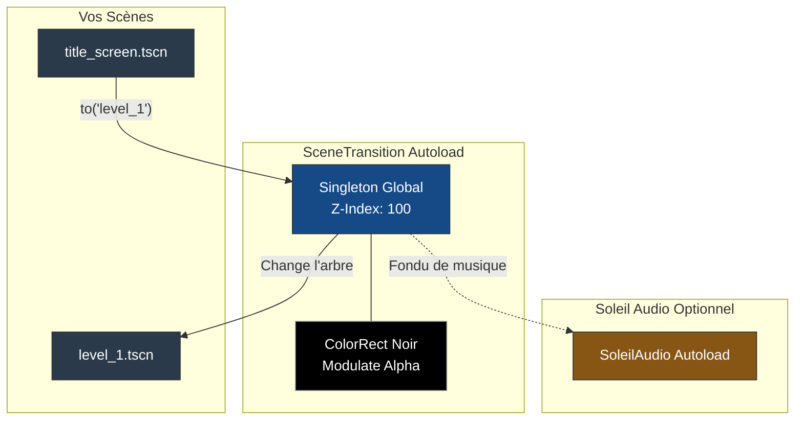

# Soleil Transition Module 🚪

Un module Godot 4 fournissant un gestionnaire global robuste pour gérer le passage d'une scène à l'autre (ex: de l'écran titre vers le niveau 1) de manière élégante, avec des animations de "Fade to black".

## 🏗️ Architecture

Le système s'articule autour d'un Autoload persistant `SceneTransition` qui vit indépendamment de la hiérarchie de vos scènes sur une surcouche visuelle (CanvasLayer) au Z-Index maximum.



## 📦 Installation (Git Submodule)

Pour pouvoir mettre à jour ce module utilitaire via Git :

1. À la racine de votre projet Git, ouvrez un terminal et exécutez la commande suivante :
   ```bash
   git submodule add https://github.com/MarioTheKnight/soleil-transition.git addons/soleil_transition
   ```
2. Ouvrez votre projet dans l'éditeur Godot.
3. Allez dans **Projet > Paramètres du projet > Extensions (Plugins)**.
4. Cochez **Activé** à côté de "Soleil Transition".
5. L'Autoload `SceneTransition` sera automatiquement enregistré.

---

## 💻 Utilisation Programatique (GDScript)

Changer de scène dans Godot avec la méthode native `get_tree().change_scene_to_file()` produit une "coupure au couteau", souvent disgracieuse et hachée visuellement si la nouvelle scène est lourde à charger.
L'Autoload `SceneTransition` masque tout cela derrière un élégant rideau noir.

### Le passage classique (Fondu)
Appelez simplement la méthode `.to()` depuis n'importe quel script de votre jeu :

```gdscript
func _on_porte_ouverte():
    # Coupe la scène au noir, puis dévoile le niveau 2 
    # (Durée de fondu par défaut: 0.4s pour la descente, 0.4s pour la remontée)
    SceneTransition.to("res://niveaux/level_2.tscn")
```

### Le passage paramétrable
Vous pouvez finement contrôler la transition :

```gdscript
# Change de scène instantanément sans fondu visuel
SceneTransition.to("res://menus/game_over.tscn", SceneTransition.TransitionType.INSTANT)

# Un très très long fondu au noir d'1.5 seconde
SceneTransition.to("res://credits.tscn", SceneTransition.TransitionType.FADE, 1.5)
```

> **🎶 Intégration Magique (Soleil Audio)**
> Si vous utilisez également le module `soleil_audio`, vous savez que changer de scène ne coupe pas nativement la musique (ce qui est voulu). 
> Cependant, si vous souhaitez que la musique s'éteigne *exactement en même temps* que l'écran s'assombrit, passez `true` en quatrième paramètre !
> ```gdscript
> # Coupe la musique avant de lancer la nouvelle scène
> SceneTransition.to("res://menu.tscn", SceneTransition.TransitionType.FADE, 0.4, true)
> ```

### Attendre ou Écouter la transition (Signaux)
Si vous avez besoin que votre jeu mette le joueur en pause le temps de la transition, l'Autoload expose deux signaux utiles et un état :

```gdscript
func _process(_delta):
    # Désactiver les contrôles du joueur pendant le fondu
    if SceneTransition.is_transitioning():
        return
        
    # Suite de la logique normal de votre joueur...
    move_player()
```

Ou en s'abonnant dynamiquement :
```gdscript
func _ready():
    # Déclenché quand le fondu au noir commence
    SceneTransition.transition_started.connect(func(): print("Aurevoir !"))
    
    # Déclenché quand la nouvelle scène est 100% visible
    SceneTransition.transition_finished.connect(func(): print("Bonjour !"))
```

---

## Reference

### Signaux

| Signal | Parametres | Description |
|--------|------------|-------------|
| `transition_started` | aucun | Emis quand le fondu au noir commence |
| `transition_finished` | aucun | Emis quand la nouvelle scene est 100% visible |

### Enum TransitionType

| Valeur | Description |
|--------|-------------|
| `FADE` | Fondu au noir puis fondu d'ouverture (defaut : 0.4s chaque) |
| `INSTANT` | Changement immediat sans animation |

### Constantes

| Constante | Valeur | Description |
|-----------|--------|-------------|
| `DEFAULT_DURATION` | `0.4` | Duree de fondu par defaut (secondes) |

### Methodes

| Methode | Description |
|---------|-------------|
| `to(scene_path: String, type: TransitionType = FADE, duration: float = 0.4, stop_music: bool = false)` | Transition vers une scene |
| `is_transitioning() -> bool` | `true` si une transition est en cours |

### Dependances

| Module | Requis ? | Integration |
|--------|----------|-------------|
| `soleil_audio` | non | Si present et `stop_music = true` : coupe la musique au moment le plus sombre du fondu |
